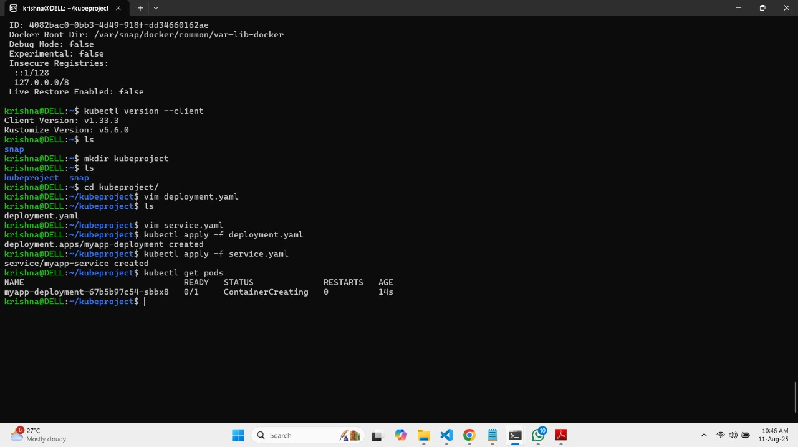
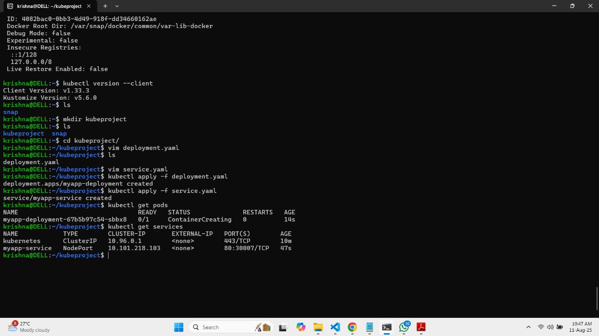
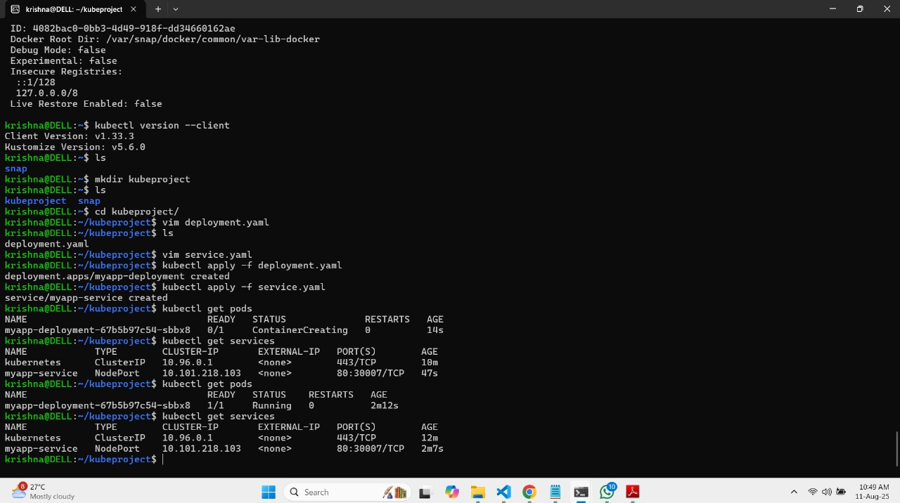
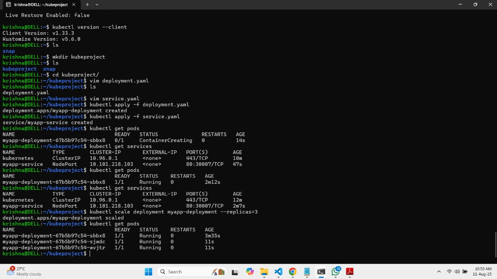
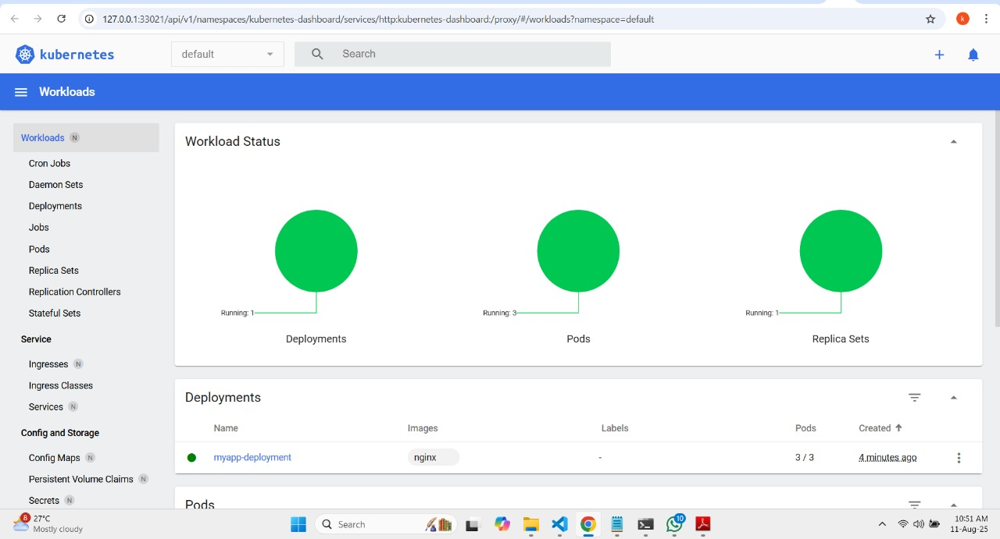
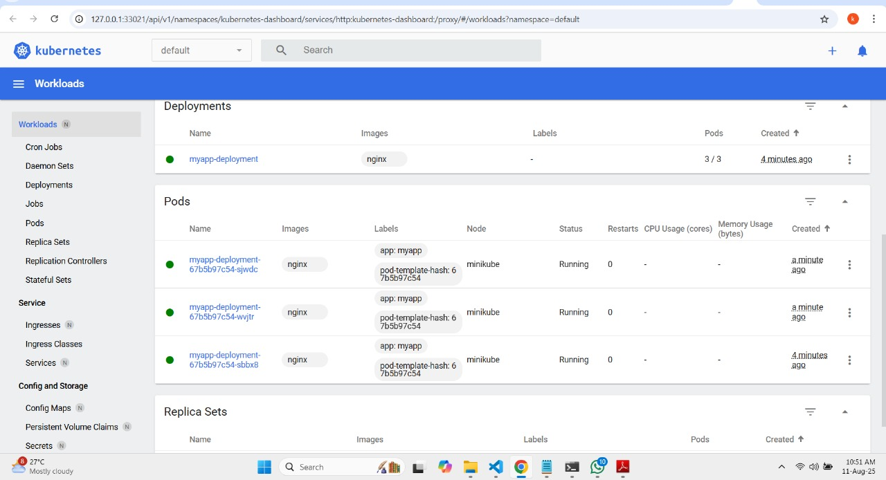
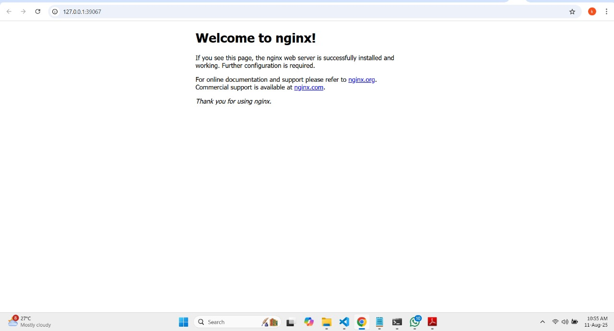
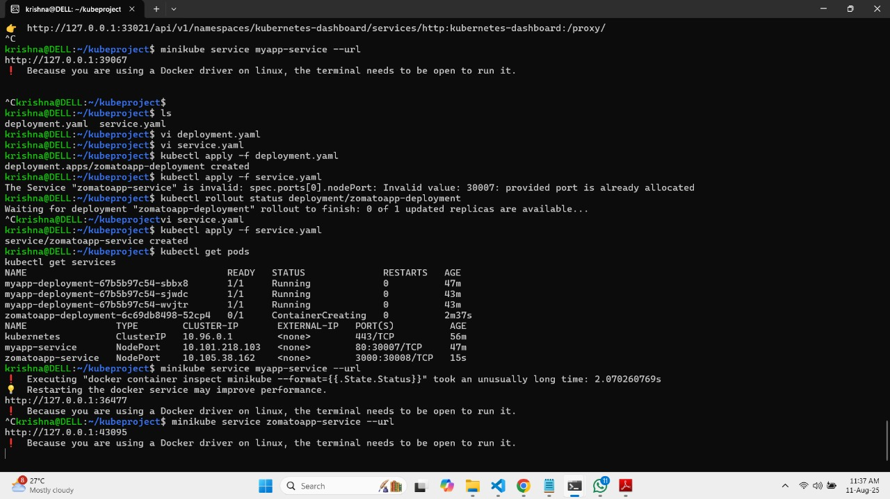

# README: Building a Kubernetes Cluster Locally with Minikube on Windows WSL

This README explains the step-by-step process to build and manage a Kubernetes cluster locally using Minikube with Docker on Windows Subsystem for Linux (WSL). It includes installation, deployment, service exposure, scaling, and logging verification as per the project requirements.

***

## Objective
Deploy and manage applications in Kubernetes locally.

## Tools Used
- Minikube
- kubectl (Kubernetes CLI)
- Docker Desktop (with WSL integration)
- Windows Subsystem for Linux (WSL)

***

## Steps

### 1. Setup Environment

#### a. Install Docker Desktop with WSL Integration
- Download and install Docker Desktop from the official Docker site.
- Enable WSL 2 integration in Docker Desktop settings to allow Docker to work inside WSL.
- Start Docker Desktop and verify it runs by executing:
  ```bash
  docker info
  ```

#### b. Install WSL (Windows Subsystem for Linux)
- In Windows PowerShell (Admin), run:
  ```powershell
  wsl --install
  ```
- Set up your preferred Linux distribution (e.g., Ubuntu) from the Microsoft Store.
- Open your WSL terminal and update packages:
  ```bash
  sudo apt update && sudo apt upgrade -y
  ```

***

### 2. Install Kubernetes Tools inside WSL

#### a. kubectl Installation
- Download kubectl binary:
  ```bash
  curl -LO "https://dl.k8s.io/release/$(curl -L -s https://dl.k8s.io/release/stable.txt)/bin/linux/amd64/kubectl"
  ```
- Make kubectl executable:
  ```bash
  chmod +x ./kubectl
  sudo mv ./kubectl /usr/local/bin/kubectl
  ```
- Verify installation:
  ```bash
  kubectl version --client
  ```

#### b. Install Minikube
- Download Minikube binary:
  ```bash
  curl -LO https://storage.googleapis.com/minikube/releases/latest/minikube-linux-amd64
  ```
- Install Minikube:
  ```bash
  sudo install minikube-linux-amd64 /usr/local/bin/minikube
  ```
- Verify:
  ```bash
  minikube version
  ```

***

### 3. Start Minikube Cluster
- Start Minikube with Docker driver inside WSL:
  ```bash
  minikube start --driver=docker
  ```
- Verify cluster is running:
  ```bash
  kubectl cluster-info
  ```

***

### 4. Create Kubernetes Deployment and Service YAML

#### a. deployment.yaml
```yaml
apiVersion: apps/v1
kind: Deployment
metadata:
  name: zomatoapp-deployment
spec:
  replicas: 1
  selector:
    matchLabels:
      app: zomatoapp
  template:
    metadata:
      labels:
        app: zomatoapp
    spec:
      containers:
      - name: zomatoapp-container
        image: krishnahogale/zomatoapp:latest
        ports:
        - containerPort: 3000
```

#### b. service.yaml
```yaml
apiVersion: v1
kind: Service
metadata:
  name: zomatoapp-service
spec:
  type: NodePort
  selector:
    app: zomatoapp
  ports:
    - protocol: TCP
      port: 3000
      targetPort: 3000
```

***

### 5. Deploy the Application on Kubernetes
- Apply deployment and service:
  ```bash
  kubectl apply -f deployment.yaml
  kubectl apply -f service.yaml
  ```
- Verify pods running:
  ```bash
  kubectl get pods
  ```
- Verify services and note the assigned NodePort:
  ```bash
  kubectl get services
  ```

***

### 6. Access the Application
- Get URL to access service:
  ```bash
  minikube service zomatoapp-service --url
  ```
- Copy the displayed URL and open it in your browser.

***

### 7. Manage the Deployment

#### a. Scale the Deployment
- To scale pods, run:
  ```bash
  kubectl scale deployment zomatoapp-deployment --replicas=3
  kubectl get pods
  ```
- Take a screenshot of the increased pods running.

#### b. View Detailed Logs and Info
- Describe pods for logs and events:
  ```bash
  kubectl describe pod 
  ```
- Describe services:
  ```bash
  kubectl describe service zomatoapp-service
  ```

***

### Deliverables Summary
- **YAML files:** `deployment.yaml` and `service.yaml`.
- **Screenshots:** Of pods deployment (`kubectl get pods`), services (`kubectl get services`), scaled pods, and relevant describe outputs.
- **Application access:** URL from `minikube service` command.

***
Delete all deployments and services (complete cleanup)
If you want to fully remove the running deployments and services:

```bash
kubectl delete deployment --all
kubectl delete service --all


<div align="center">
  
</div>

<div align="center">
  
</div>

<div align="center">
  

  <div align="center">
  
</div>

<div align="center">
  
</div>

<div align="center">
  
</div>

<div align="center">
  

  <div align="center">
  
</div>

<div align="center">
  
</div>
